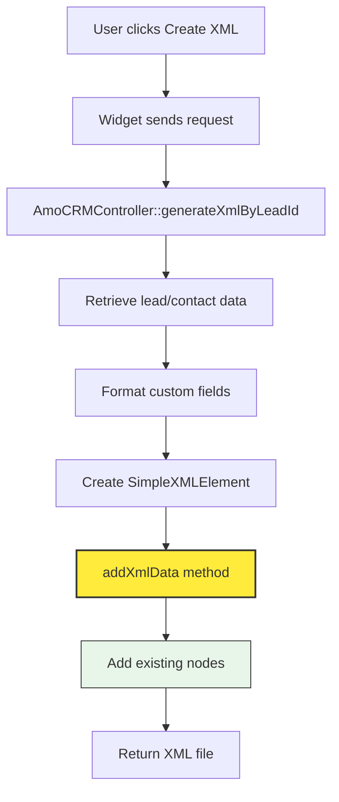
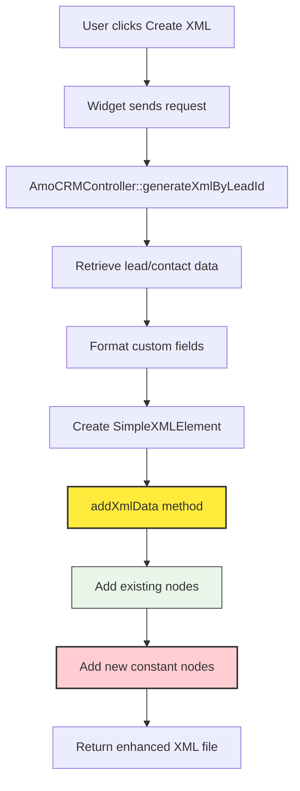
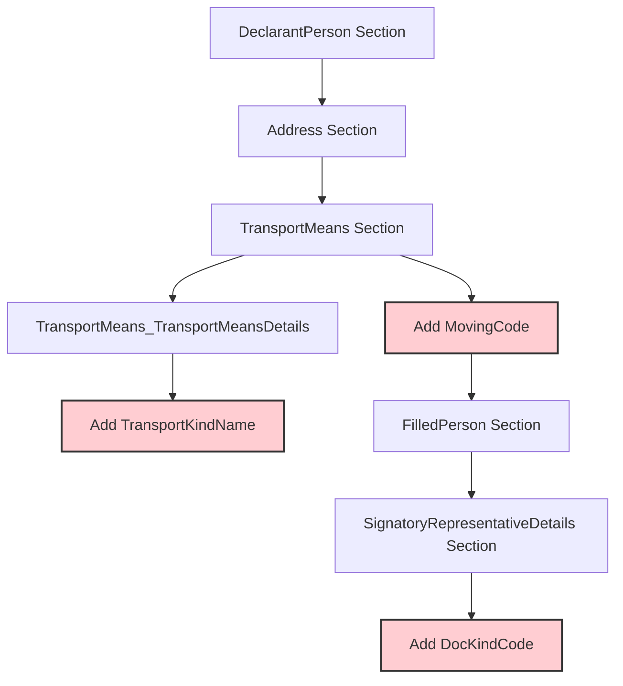

# XML Node Addition Enhancement

## Overview

This design document outlines the enhancement to the AVTerminal XML generation system to include three additional constant XML nodes required for Alta-GTD customs declaration format. The modification involves adding transport means details, document kind code, and movement method to the existing XML structure.

## Repository Type

**Backend Application** - Laravel-based API service with XML generation capabilities for customs declarations.

## Architecture

### Current XML Generation Flow



### Enhanced XML Generation Flow



## XML Structure Enhancement

### New Nodes to be Added

| Node Name | Value | Position | Description |
|-----------|-------|----------|-------------|
| `MovingCode` | `3` | After existing transport nodes | Movement method identifier |
| `TransportKindName` | `АВТОДОРОЖНЫЙ ТРАНСПОРТ, ЗА ИСКЛЮЧЕНИЕМ ТРАНСПОРТНЫХ СРЕДСТВ, УКАЗАННЫХ ПОД КОДАМИ 31, 32` | Within `TransportMeans_TransportMeansDetails` | Transport type specification (UPPERCASE) |
| `SignatoryRepresentativeDetails_RepresentativeContractDetails_DocKindCode` | `11002` | Within SignatoryRepresentativeDetails section | Contract document type code |

### XML Schema Integration

```xml
<!-- Enhanced TransportMeans_TransportMeansDetails section -->
<TransportMeans_TransportMeansDetails>
    <Mark>{EXISTING_MARK}</Mark>
    <Model>{EXISTING_MODEL}</Model>
    <VINID>{EXISTING_VIN}</VINID>
    <BodyID>{EXISTING_VIN}</BodyID>
    <TransportModeCode>30</TransportModeCode>
    <TransportMeansRegId>ОТСУТСТВУЕТ</TransportMeansRegId>
    <ChassisID>ОТСУТСТВУЕТ</ChassisID>
    <TypeIndicator>1</TypeIndicator>
    <!-- NEW NODE -->
    <TransportKindName>АВТОДОРОЖНЫЙ ТРАНСПОРТ, ЗА ИСКЛЮЧЕНИЕМ ТРАНСПОРТНЫХ СРЕДСТВ, УКАЗАННЫХ ПОД КОДАМИ 31, 32</TransportKindName>
</TransportMeans_TransportMeansDetails>

<!-- NEW TOP-LEVEL NODE -->
<MovingCode>3</MovingCode>

<!-- Enhanced SignatoryRepresentativeDetails section -->
<SignatoryRepresentativeDetails_BrokerRegistryDocDetails_DocKindCode>09034</SignatoryRepresentativeDetails_BrokerRegistryDocDetails_DocKindCode>
<SignatoryRepresentativeDetails_BrokerRegistryDocDetails_RegistrationNumberId>1695</SignatoryRepresentativeDetails_BrokerRegistryDocDetails_RegistrationNumberId>
<!-- NEW NODE -->
<SignatoryRepresentativeDetails_RepresentativeContractDetails_DocKindCode>11002</SignatoryRepresentativeDetails_RepresentativeContractDetails_DocKindCode>
<SignatoryRepresentativeDetails_RepresentativeContractDetails_PrDocumentName>ДОГОВОР С ТАМОЖЕННЫМ ПРЕДСТАВИТЕЛЕМ</SignatoryRepresentativeDetails_RepresentativeContractDetails_PrDocumentName>
```

## Implementation Details

### Code Modification Requirements

#### File: `AmoCRMController.php`
**Method:** `addXmlData()`
**Location:** Lines 183-275

#### Modification Points

1. **TransportKindName Addition**
   - Insert within existing `TransportMeans_TransportMeansDetails` section
   - Position: After `TypeIndicator` node
   - Value: Static constant string in UPPERCASE format

2. **MovingCode Addition**
   - Insert as top-level node
   - Position: After `TransportMeans_TransportMeansDetails` section
   - Value: Static constant `3`

3. **DocKindCode Addition**
   - Insert within `SignatoryRepresentativeDetails` section
   - Position: After `RegistrationNumberId` node
   - Value: Static constant `11002`

### Node Positioning Strategy



### Data Flow Impact

The enhancement maintains backward compatibility and does not affect:
- AmoCRM API integration
- Existing field mapping logic
- Custom field processing
- Authentication mechanisms
- Response format

### Text Formatting Requirements

All new string values must follow the existing XML formatting convention:
- Text values are converted to UPPERCASE using `mb_strtoupper()` function
- Maintains consistency with existing field processing in `formatCustomFields()` method
- Ensures compliance with Alta-GTD text formatting standards

### Configuration Values

| Configuration | Value | Type | Source |
|---------------|-------|------|--------|
| MovingCode | `3` | Integer constant | Business requirement |
| TransportKindName | `АВТОДОРОЖНЫЙ ТРАНСПОРТ, ЗА ИСКЛЮЧЕНИЕМ ТРАНСПОРТНЫХ СРЕДСТВ, УКАЗАННЫХ ПОД КОДАМИ 31, 32` | String constant (UPPERCASE) | Alta-GTD specification |
| DocKindCode | `11002` | String constant | Customs regulation |

## Testing

### Unit Test Requirements

```php
// Test case structure
class AmoCRMControllerXmlEnhancementTest extends TestCase
{
    public function test_xml_contains_new_moving_code_node()
    {
        // Verify MovingCode=3 exists in generated XML
    }
    
    public function test_xml_contains_transport_kind_name()
    {
        // Verify TransportKindName within TransportMeansDetails
    }
    
    public function test_xml_contains_doc_kind_code()
    {
        // Verify DocKindCode=11002 in SignatoryRepresentativeDetails
    }
    
    public function test_xml_node_positioning()
    {
        // Verify correct node order and hierarchy
    }
    
    public function test_xml_maintains_existing_structure()
    {
        // Ensure no regression in existing nodes
    }
}
```

### Integration Test Scenarios

1. **Complete XML Generation Test**
   - Generate XML with sample lead data
   - Validate presence of all three new nodes
   - Verify correct values and positioning

2. **XML Schema Validation**
   - Validate enhanced XML against Alta-GTD schema
   - Ensure compliance with customs requirements

3. **End-to-End Widget Test**
   - Test complete flow from widget to XML download
   - Verify file contains enhanced structure